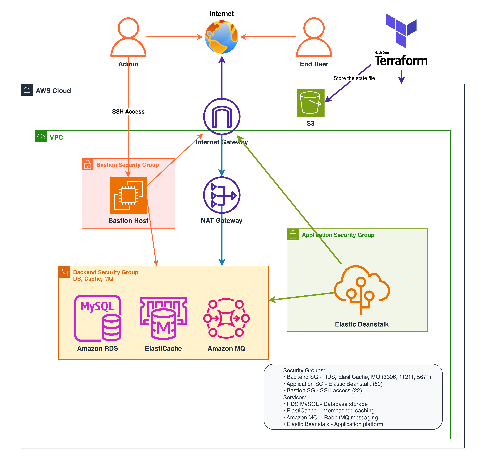

# Terraform Beanstalk Backend Infrastructure

AWS multi-tier infrastructure deployment using Terraform with **Component-Based Modular Structure**. Features 2-AZ deployment for cost optimization while maintaining high availability.

## 🏗️ Architecture



**Key Components:**
- **VPC** with 2-AZ deployment for cost optimization
- **Elastic Beanstalk** for Java application hosting
- **RDS MySQL** for database storage
- **ElastiCache Memcached** for caching
- **Amazon MQ RabbitMQ** for message queuing
- **Bastion Host** for secure database access

## 📁 Project Structure

```
terraform/
├── main.tf               # Main orchestration file
├── variables.tf          # Input variable definitions
├── terraform.tfvars      # Variable values (excluded from git)
├── outputs.tf            # Output definitions
├── provider.tf           # AWS provider configuration
└── modules/              # Modular components
    ├── network/          # VPC & Security Groups
    ├── storage/          # RDS & ElastiCache
    ├── messaging/        # Amazon MQ
    └── compute/          # Bastion & Beanstalk
```

**Deployment Flow:**
1. **Network Layer**: VPC → Security Groups
2. **Storage Layer**: RDS → ElastiCache
3. **Messaging Layer**: Amazon MQ
4. **Compute Layer**: Bastion → Beanstalk

## 🚀 Quick Start

**Prerequisites:**
- AWS CLI configured with credentials
- Terraform v1.0+ installed
- SSH key pair for EC2 access

**Deployment Steps:**

1. **Setup Repository:**
```bash
git clone <your-repo-url>
cd terraform
cp terraform.tfvars.example terraform.tfvars
```

2. **Generate SSH Keys:**
```bash
mkdir -p modules/compute/keypairs/keys
ssh-keygen -t ed25519 -f modules/compute/keypairs/keys/keypair_ssh
```

3. **Deploy Infrastructure:**
```bash
terraform init
terraform plan
terraform apply
```

4. **Configure Application:**
```bash
# Get endpoints from Terraform outputs
terraform output

# Clone the application repository
git clone -b terraform-project https://github.com/hkhcoder/vprofile-project.git
cd vprofile-project

# Update application.properties with actual AWS endpoints:
# - RDS endpoint for database
# - ElastiCache endpoint for memcached
# - Amazon MQ endpoint for rabbitmq
```

5. **Build Application:**
```bash
# After updating application.properties
mvn clean install
ls target/vprofile-v2.war
```

## ⚙️ Configuration

**Key Variables in `terraform.tfvars`:**

```hcl
# AWS Configuration
aws_region = "eu-north-1"
project_name = "your-project-name"

# Security - Update with your IP
allowed_ssh_ips = ["YOUR_IP_ADDRESS/32"]

# Database Passwords - Change these!
db_password = "your-secure-db-password"
mq_password = "your-secure-mq-password"
```

**Benefits of 2-AZ Configuration:**
- 40% fewer resources compared to 3-AZ setup
- Reduced complexity with fewer routing tables
- Production-ready with high availability maintained

## � CI/CD Pipeline

**GitHub Actions Integration:**
This project includes automated CI/CD pipeline with Terraform validation and security checks.

**Pipeline Features:**
- **Terraform Format Check**: Ensures code formatting standards
- **Terraform Validation**: Validates configuration syntax
- **Security Scanning**: Basic security checks for sensitive data
- **Environment Secrets**: Secure AWS credentials management

**Environment Setup:**
1. **GitHub Environment**: Create `terraform-beanstalk-secrets` environment
2. **Required Secrets**:
   - `AWS_ACCESS_KEY_ID`
   - `AWS_SECRET_ACCESS_KEY`
   - `AWS_REGION`

**Local Testing:**
```bash
# Run CI validation locally
./scripts/ci-validation.sh

# Run simple CI tests
./scripts/test-ci.sh
```

**Pipeline Triggers:**
- Push to `main` branch
- Pull requests to `main` branch

## �🛠️ Commands

**Basic Operations:**
```bash
# Initialize and deploy
terraform init
terraform plan
terraform apply

# Update infrastructure
terraform plan && terraform apply

# Destroy infrastructure
terraform destroy
```

**Verification:**
```bash
# Check resources
terraform show | grep -E "(aws_instance|aws_db_instance)"

# Get endpoints
terraform output
```

## 🔧 Troubleshooting

**Common Issues:**

1. **Application Configuration**
   - Ensure `application.properties` has real AWS endpoints (not localhost)
   - Update endpoints BEFORE running `mvn install`

2. **SSH Access**
   - Verify your IP in `allowed_ssh_ips`
   - Check SSH key permissions: `chmod 600 modules/compute/keypairs/keys/keypair_ssh`

3. **Terraform State**
   - Use `terraform refresh` to sync state
   - Use S3 backend for team collaboration

## 📚 Resources

- [Terraform AWS Provider](https://registry.terraform.io/providers/hashicorp/aws/latest/docs)
- [AWS Well-Architected Framework](https://aws.amazon.com/architecture/well-architected/)
- [Terraform Best Practices](https://www.terraform.io/docs/cloud/guides/recommended-practices/index.html)

## 📞 Contact

**Email:** moamenahmed800@gmail.com  
**LinkedIn:** [linkedin.com/in/moamen800](https://www.linkedin.com/in/moamen800)

---

*This infrastructure is designed for development and learning purposes. For production use, implement additional security measures, monitoring, and backup strategies.*

